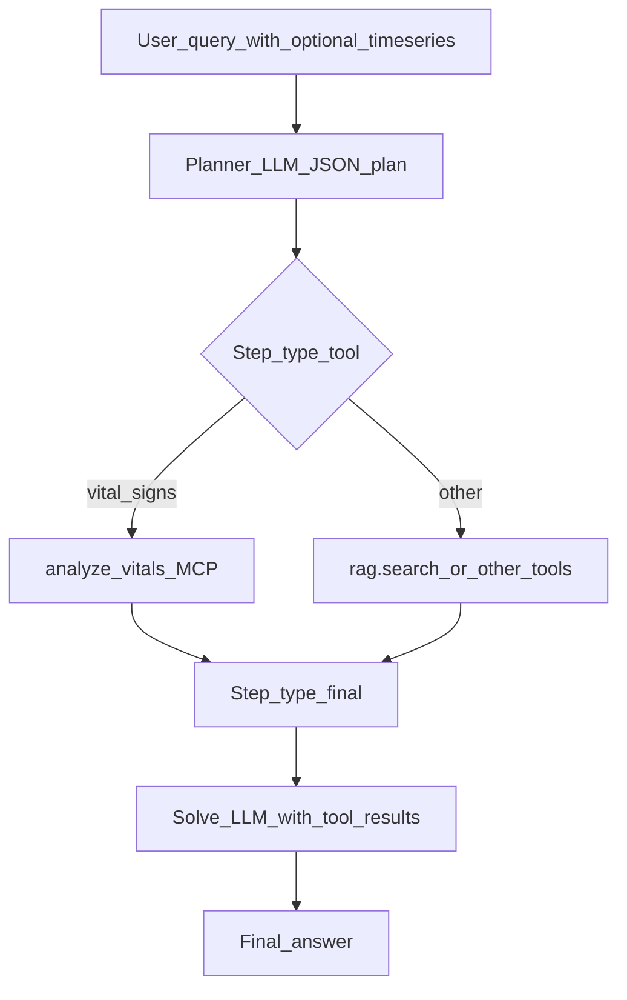

# PandaMind 技术面试指南（物种生理 · MCP · 与 PetMind 编排）

本文档中的 **PandaMind** 是便于面试叙述的 **产品/子系统名称**：在仓库源码中 **不出现** 该字符串。其技术锚点为 **`mcp_servers/vital_signs_analyzer`** MCP 服务（含 **大熊猫 `panda`** 与犬、猫的参考生理区间），以及 PetMind Agent 中对该工具的 **规划与调用约束**。主系统全貌见同目录 [`PETMIND_INTERVIEW_GUIDE.md`](PETMIND_INTERVIEW_GUIDE.md)。

---

## 面试 60 秒电梯陈述

**中文：** PandaMind 这条线强调 **非对话文本、而是时序生理数据**：心率、呼吸率、体温等采样进入 MCP 工具 `analyze_vitals`，在 **物种分桶（狗/猫/大熊猫）** 下做统计、趋势、越界与简易 HRV 指标，输出结构化摘要与告警等级；该结果作为 **tool_results** 回灌 PetMind 的 **Plan-and-Solve 生成阶段**，由 LLM 结合兽医提示做临床解读。实现上 **纯 NumPy**，无额外深度学习推理，便于部署与解释。

**English:** The “PandaMind” track is the **species-conditioned vital-signs pipeline**: time-series HR/RR/temperature go into the MCP tool **`analyze_vitals`**, which applies **species-specific reference ranges** (dog, cat, giant panda), computes stats/trends/anomalies and lightweight HRV-style metrics, and returns a structured clinical summary. That JSON flows back into PetMind’s **plan-and-solve solve stage** as **tool_results** for LLM synthesis under veterinary prompts. The server is **NumPy-only**—no extra DL inference—prioritizing **latency, determinism, and explainability**.

---

## 1. 定位与与 PetMind 的关系

| 维度 | PetMind（主系统） | PandaMind（本子叙事） |
|------|-------------------|------------------------|
| 入口 | 同一 FastAPI：`/v1/chat/completions` 等 | 不单独暴露端口 |
| 数据形态 | 自然语言问题为主 | **结构化时序测量**（`t_s` + 数值） |
| 核心代码 | 全栈 Agent + RAG | `mcp_servers/vital_signs_analyzer/server.py` |
| LLM 职责 | 规划工具 + 综合回答 | **不直接算生理指标**；解读 MCP 输出 |

**面试一句话：** PandaMind 不是第二套后端，而是 **「物种感知生理分析 MCP + PetMind Agent 编排」** 的组合能力；大熊猫场景用于体现 **动物园/野生动物** 与家养宠物的 **参考范围差异**。

### 1.1 前后端框架（与 PetMind 相同）

PandaMind **不单独占一套前后端**：用户仍通过 **PetMind 的 FastAPI + Uvicorn** 访问 `/v1/chat/completions` 等；浏览器侧仍可能是 **`/chat` 内嵌页** 或 **`web/` 静态站**，与 [PETMIND 文档](PETMIND_INTERVIEW_GUIDE.md) **§1.1 前后端框架** 一节一致。

**仅多出来的子进程侧：** `vital_signs_analyzer` 为 **Python MCP stdio 服务**，业务计算 **NumPy**（无独立 Web 框架）。面试表述：**「前后端框架跟主 Agent 一样；差异在多了一个生理分析 MCP。」**

---

## 2. MCP 架构：`vital_signs_analyzer`

### 2.1 进程与配置

- **包入口：** `python -m mcp_servers.vital_signs_analyzer`（见 `mcp_servers/vital_signs_analyzer/__main__.py`）
- **MCP Server 名：** `vital_signs_analyzer`（`Server("vital_signs_analyzer")`）
- **注册到 Agent：** `agent_api/mcp_servers.json` 中 `name: "vital_signs_analyzer"`，`transport: "stdio"`，`enabled: true`
- **工具在 Agent 侧全名：** `mcp.vital_signs_analyzer.analyze_vitals`（与 `routes_openai.py` 默认允许工具列表一致）

部署时请将 JSON 里的 `command` 改为当前机器的 Python 路径（与 PetMind 文档中 MCP 说明相同）。

### 2.2 物种参考区间 `SPECIES_RANGES`

定义位置：`mcp_servers/vital_signs_analyzer/server.py` 文件顶部。

| 物种 | `species` 枚举值 | 内容（示例维度） |
|------|-------------------|------------------|
| 犬 | `dog` | HR / RR / 体温 正常区间 + 中文标签 |
| 猫 | `cat` | 同上（猫科心率区间与犬不同） |
| 大熊猫 | `panda` | 同上（野生动物生理区间与家养动物区分） |

**面试点：** 为何不用单一「宠物」区间？—— **异种/异宠生理基线不同**，错误基线会导致假阴/假阳；大熊猫条目支撑 **动物园/保护生物学** 叙事。

### 2.3 算法模块（可解释、无 DL）

同一文件内核心函数（名称以源码为准）：

| 模块 | 作用 |
|------|------|
| `_basic_stats` | 均值、中位数、标准差、最值、样本数 |
| `_hrv_metrics` | 由 RR 间期（由 HR 推导）计算 SDNN、RMSSD、pNN50 等简化 HRV 指标 |
| `_trend` | 对时间序列做线性趋势（上升/下降/稳定） |
| `_detect_anomalies` | 相对物种正常范围的越界、大幅波动等 |
| `_detect_apnea` | 呼吸采样上的呼吸暂停类事件检测（阈值等见源码） |
| `_compute_alert_level` | 由异常列表聚合告警等级 |
| `_build_clinical_summary` | 生成可读 **临床摘要** 字符串 |

**工具对外契约：** `analyze_vitals(species, weight_kg, hr_samples, rr_samples, temp_samples)`，采样格式为 `{ "t_s": 秒, "hr"|"rr"|"value": 数值 }`（体温用 `value`），详见 MCP `inputSchema`。

### 2.4 工具描述中的「防误用」设计

`list_tools()` 里对 `analyze_vitals` 的 `description` 明确写明：

- **仅当用户提供真实生理测量数据时调用**
- **没有测量数据的一般健康问题不要调用**

这与 Agent 规划器中的中文规则一致（见下节），用于降低 **无意义工具调用** 与 **幻觉式数值分析**。

---

## 3. 与 PetMind Agent 的编排衔接

### 3.1 规划阶段（何时调生理工具）

文件：`agent_api/app/plan_and_solve.py`，`AsyncPlanAndSolveAgent.plan()` 的系统提示要点包括：

- 含心率/呼吸率/体温等时序数据 → **`mcp.vital_signs_analyzer.analyze_vitals`**
- **仅当用户提供了实际的生理测量数据时才调用**；普通健康问题不需要

**面试表述：** 这是典型的 **tool-routing policy**：把「是否需要数值工具」写进 **planner system prompt**，与 RAG/Web 路由并列，减少无效 MCP 往返。

### 3.2 执行与生成阶段

执行时：`solve()` 遍历 plan，对 `type=="tool"` 调用 `ToolRegistry.call`；收集的 `tool_results` 与 `plan`、用户 `query` 一并 JSON 序列化后作为 user message 发给 LLM。生成侧系统提示仍由 **`build_solve_prompt(user_role, has_web_search, query)`** 构建（兽医/宠主、引用规范、证据分层等），与主文档 **第 3.5 节** 一致。

**关键点：** 数值结论应 **锚定在 MCP 返回的 stats/anomalies/alert_level**；LLM 负责 **解释、鉴别建议、是否需就医**，而不是重新「编造」统计量。

### 3.3 与 RAG 的协作叙事（面试）

典型用户问题可能同时包含：**「这几天心率日志 + 是否可能是某病」**。

合理编排：**先 `analyze_vitals`** 得到客观摘要 → **再 `rag.search`** 拉疾病与鉴别诊断文献 → **solve** 阶段用兽医证据分层输出。具体顺序由 planner JSON 决定，你可以在面试中举例说明 **为何先客观后文献**。

---

## 4. 本地调试

### 4.1 单独启动 MCP（stdio）

MCP 设计为被宿主进程 fork/exec；单独调试时可使用支持 MCP 的客户端，或临时写最小脚本通过 stdio 发 `list_tools` / `call_tool`。日常推荐 **直接走 Agent**：`POST /v1/chat/completions` 且在消息里附上符合 schema 的 JSON 采样数组。

### 4.2 通过 PetMind 验证

1. 启动 `uvicorn agent_api.app.main:app`（见 PetMind 文档第 6 节）。  
2. 确认 `AGENT_ENABLE_MCP=1` 且 `mcp_servers.json` 中 `vital_signs_analyzer` 已启用。  
3. 请求中 `model` 使用 `agent-plan-solve`，用户内容包含 **明确采样点** 并观察 `tool_results` 是否出现 `mcp.vital_signs_analyzer.analyze_vitals`。

---

## 5. Roadmap（面试加分，非当前仓库承诺）

以下可作为 **设计演进方向**，避免声称已实现：

| 方向 | 说明 |
|------|------|
| 合成数据评测 | 构造已知越界/趋势的 HR/RR 序列，统计告警 **precision/recall** |
| 文献子索引 | 野生动物麻醉、生理监测专著 → 独立 `index_dir`，RAG 路由到「动物园医学」库 |
| 多模态接入 | 雷达/BLE 原始波形在别的服务压缩为 `hr_samples` 再进 MCP（与 `Animal_detection/integration` 衔接属系统级故事） |
| 校准与个体基线 | 由「物种默认区间」演进为「个体历史分位数」异常检测 |

---

## 6. 与 PetMind 文档交叉索引

| 主题 | 见 PetMind 文档 |
|------|-----------------|
| RAG 建库与混合检索 | [PETMIND_INTERVIEW_GUIDE.md](PETMIND_INTERVIEW_GUIDE.md) 第 2 节 |
| Plan-and-Solve / 兽医提示 | 第 3 节 |
| 启动与环境变量 | 第 4、6 节 |
| 前端 `/chat` | 第 5 节 |

---

## 7. 面试短答

**Q：为什么生理分析不用神经网络？**  
A：当前目标是 **可解释、低依赖、易部署**：规则+统计即可覆盖「是否越界、趋势方向、简易 HRV」；神经网络可放在 **后续版本** 做节律分类等，并与本 MCP 输出融合。

**Q：大熊猫和狗猫在系统里差异是什么？**  
A：**`SPECIES_RANGES` 不同** → 异常检测阈值不同；工具 schema 限制 `species` 枚举为 `dog|cat|panda`，避免随意字符串。

**Q：如何避免 LLM 编造心率？**  
A：**禁止无数据调 vital 工具**；生成阶段只解读 **tool_results** 中的字段；兽医模式下对医学问题还有 **证据分层** 与不足声明（见 PetMind 文档）。
