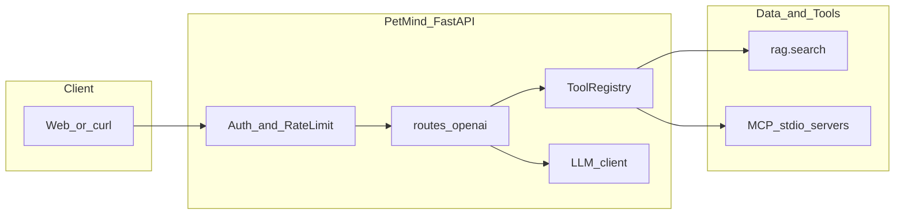

# PetMind 技术面试指南（RAG · Agent · 前后端）

面向 **Agent 工程师实习** 面试：从语料入库到工具编排、API 与内嵌前端的完整叙事。代码根目录：`Animal_detection/agentAndRag/`（下文路径均相对该目录）。

---

## 面试 60 秒电梯陈述

**中文：** PetMind 是一套基于 FastAPI 的宠物健康 Agent 服务：用户通过 OpenAI 兼容的聊天接口提问；系统先用 LLM 做 **Plan-and-Solve（JSON 规划 → 顺序调工具 → 再生成）** 或 **多轮工具循环**；工具侧包含 **混合 RAG（稠密向量 + 自研 BM25 + RRF 融合 + CrossEncoder 重排）** 以及 **MCP 子进程**（网络搜索、营养计划、生理信号分析等）。生成阶段用 **角色化系统提示（宠物主人 / 兽医）** 和 **引用与证据分层** 约束回答，并配有鉴权、限流、JSONL 追踪与 SQLite 问答记录。

**English:** PetMind is a FastAPI-based pet-health agent: OpenAI-compatible `/v1/chat/completions` drives either **plan-and-solve** (strict JSON plan, sequential tools, final synthesis) or **multi-turn** tool loops. Tools include **hybrid RAG** (dense + BM25 + RRF + optional cross-encoder rerank) and **stdio MCP servers** (web search, nutrition, vitals). The solve stage uses **role-conditioned prompts** (owner vs veterinarian) plus **citation and evidence-layering** rules; the stack adds **API keys, token-bucket rate limits, trace logging, and SQLite QA storage**.

---

## 1. 系统目标与边界

| 能力 | 说明 |
|------|------|
| 核心场景 | 犬猫等宠物健康问答、营养与运动建议、成分与网络信息补充 |
| 知识增强 | 本地兽医语料 RAG（`.mmd` 书籍切块索引） |
| 工具扩展 | MCP：Tavily 搜索、配料检查、膳食/运动计算器、生理时序分析 |
| 非目标（面试可主动说） | 不替代执业兽医诊断；高风险输出靠提示词与「证据不足」声明约束 |

### 1.1 前后端框架（面试可一句话说清）

**后端（Backend）：**

| 层次 | 技术 |
|------|------|
| Web / ASGI | **Python** + **FastAPI**（底层 **Starlette** ASGI） |
| 进程入口 | **Uvicorn**（`python -m uvicorn agent_api.app.main:app`） |
| 数据校验 | **Pydantic**（`schemas.py`、`schemas_openai.py` 等） |
| HTTP 客户端 | **httpx**（调用兼容 OpenAI 的 LLM `chat/completions`） |
| RAG / 模型 | **sentence-transformers** + **PyTorch**（embedding / CrossEncoder 重排）；向量与 BM25 侧以 **NumPy** 为主 |
| 存储 | **SQLite**（问答与反馈，`qa_store`）；**JSONL**（追踪 `trace_store`） |
| 工具扩展 | **MCP Python SDK**（`mcp` 包），子进程 **stdio** 与宿主通信 |

**前端（Frontend）——本项目没有单独 React/Vue 工程：**

| 形态 | 技术 |
|------|------|
| PetMind 自带页 | **服务端模板式页面**：`routes_chat_ui.py` 返回 **HTML 字符串 + 内联 JavaScript**，用 **`fetch` / `EventSource`（SSE）** 调同源 **`/v1/chat/completions`** |
| 可选主站 | `Animal_detection/web/`：**静态 HTML + JS**（如 `http.server` 托管），通过配置把 Agent 指到 `:8000` |

**结论：** 后端是 **FastAPI 单体 API + Agent/RAG/MCP**；前端是 **轻量浏览器原生 JS**，不是 Next.js / Vue CLI 那类前后端分离脚手架。若面试问「为何不用框架」，可答：**迭代快、部署单端口、与 OpenAI 兼容接口天然同源**。

### 请求路径总览（Mermaid）



**关键文件：** `agent_api/app/main.py`（应用装配）、`agent_api/app/routes_openai.py`（聊天入口）、`agent_api/app/auth.py`、`agent_api/app/rate_limit.py`。

---

## 2. RAG：从 0 到可检索

### 2.1 数据与产物目录

| 路径 | 作用 |
|------|------|
| `RAG/data/raw/**/*.mmd` | 原始书籍/讲义（递归扫描） |
| `RAG/data/rag_index_e5/`（默认） | 索引目录：`embeddings.npy`、`meta.jsonl`、`store_config.json` |

默认索引目录由 `RAG/simple_rag/config.py` 的 `default_config()` 决定：`index_dir = RAG/data/rag_index_e5`。

### 2.2 安装依赖

在 `agentAndRag` 下：

```bash
pip install -r RAG/requirements.txt
pip install -r agent_api/requirements.txt
```

需已安装与机器匹配的 **PyTorch**（CUDA/CPU），`sentence-transformers` 依赖其拉取 embedding 与 rerank 模型。

### 2.3 入库（建索引）

入口：`RAG/ingest.py`，内部调用 `simple_rag.pipeline.build_or_update_index`。

**常用命令：**

```bash
# 默认：raw=RAG/data/raw，index=RAG/data/rag_index_e5，模型 intfloat/multilingual-e5-small
python RAG/ingest.py

# 指定 GPU、批大小、只入库前几本做冒烟
python RAG/ingest.py --device cuda --batch-size 32 --limit-books 3

# 换 embedding 建另一套索引目录（用于消融对比）
python RAG/ingest.py --embedding-model sentence-transformers/all-MiniLM-L6-v2 --index-dir RAG/data/rag_index_minilm
```

**CLI 参数要点：** `--raw-dir`、`--index-dir`、`--embedding-model`、`--chunk-words`、`--chunk-overlap-words`、`--min-chunk-words`、`--batch-size`、`--device`、`--limit-books`。

### 2.4 清洗与分块

实现：`RAG/simple_rag/text_utils.py` 中 `chunk_text()`。

策略概要：按空行分段；段内按中英文句号/问号/感叹号切句；过长句再按逗号/分号降级；最后按 `chunk_words` / `chunk_overlap_words` 合并为 chunk 并做 overlap。详见 `RAG/README.md`。

### 2.5 向量与 E5 前缀

实现：`RAG/simple_rag/embeddings.py`。对模型名包含 `e5` 的情况会自动为 query/passage 加前缀（符合 E5 官方用法）。若曾用无前缀建库，README 建议 **重建索引** 以保证检索稳定。

### 2.6 在线检索（Agent 运行时）

实现：`agent_api/app/rag_tools.py` 中 `rag_search_tool`。

**组件：**

- `NumpyVectorStore`：加载 `embeddings.npy` + `meta.jsonl`
- `Embedder`：查询向量
- `BM25Retriever`：自研 BM25，中英文分词（英文去停用词；中文优先 jieba，否则双字 bigram）
- `MultiRouteRetriever`：多路召回 + **RRF（Reciprocal Rank Fusion）** 或 min-max 融合
- `CrossEncoderReranker`：对候选块重排
- `context_utils.build_neighbor_contexts`：邻块上下文扩展

**进程内缓存：** `_STORE_CACHE`、`_BM25_CACHE`、`_RERANKER_CACHE`、查询向量 LRU 等，避免重复加载与重复 embed。

**工具默认参数：** 见 `agent_api/app/tools_builtin.py` 中 `rag.search` 的 `input_schema`（`multi_route`、`rerank`、`expand_neighbors` 等）。

**Agent 强制策略：** `agent_api/app/plan_and_solve.py` 中 `_force_rag_search_defaults` 在 Plan-and-Solve 执行 `rag.search` 时强制 `multi_route=True`、`rerank=True`、`expand_neighbors>=1`，并设置 `rerank_candidates` 等与质量相关的默认值——面试可强调：**规划器可能漏参，执行层统一拉高 RAG 质量下限**。

### 2.7 交互式检索（调试用）

```bash
python -m RAG.query --embedding-model intfloat/multilingual-e5-small --top-k 5
```

（工作目录为 `agentAndRag`，且 `PYTHONPATH` 需能解析 `RAG` 包；与 `main.py` 启动 Agent 时环境一致即可。）

### 2.8 评测与消融（596 题准确率）

你在同一批 **596** 道题上的端到端结果（可自行在简历中引用，并准备好「如何构造题集、是否调用 LLM、温度与 prompt」等追问）：

| 检索方式 | Embedding 模型 | Top-K | 正确/总数 | 准确率 |
|----------|------------------|-------|-----------|--------|
| No-RAG | multilingual-e5-small | 0 | 529/596 | **88.76%** |
| BM25 | all-MiniLM-L6-v2 | 5 | 544/596 | 91.28% |
| Dense | multilingual-e5-small | 3 | 543/596 | 91.11% |
| BM25 + 重排 | all-MiniLM-L6-v2 | 5 | 550/596 | **92.28%** |
| BM25 + 邻域 | all-MiniLM-L6-v2 | 5 | 537/596 | 90.10% |

**结论表述建议：** 相对 No-RAG，BM25+重排 **+3.52 个百分点（88.76% → 92.28%）**；邻域在当前配置下未带来收益，可解释为窗口/融合与任务不匹配，需结合 `inspect_context_effect.py` 等脚本排查。

**仓库内实验入口：** `RAG/experiments/` — 如 `build_qa_evalset_from_alpaca.py`（构造评测集）、`run_eval.py`、`run_one_click_sweep.py`、`metrics.py`、`bench_rag_latency.py`。具体子命令以各脚本 `--help` 与 `RAG/experiments/README.md` 为准。

---

## 3. Agent 设计与编排

### 3.1 工具注册表（Tool Registry）

文件：`agent_api/app/tool_registry.py`。

- `ToolSpec`：`name`、`description`、`input_schema`、`handler`
- `async call()`：若 handler 为协程则 await，否则 `asyncio.to_thread` 包装同步函数

### 3.2 内置工具

文件：`agent_api/app/tools_builtin.py`。

| 工具名 | 作用 |
|--------|------|
| `rag.search` | 混合检索 + 可选重排 + 邻域上下文，返回 hits/contexts |
| `rag.reindex` | 从 raw 重建索引（可能很慢） |
| `debug.echo` | 调试回显（`register_debug_tools`） |

### 3.3 MCP 动态注册

文件：`agent_api/app/tools_mcp.py`、`agent_api/app/mcp_config.py`、`agent_api/app/mcp_client.py`；配置：`agent_api/mcp_servers.json`。

每个 enabled 的 server 以 **stdio 子进程** 启动，工具名通常为 `mcp.<server_name>.<tool_name>`（以实际注册名为准）。

**注意：** `mcp_servers.json` 里的 `command` 常为本机 conda Python **绝对路径**，换机器部署时必须改为当前环境的 `python`。

### 3.4 Plan-and-Solve

文件：`agent_api/app/plan_and_solve.py`。

1. **`plan()`**  
   - 系统提示要求输出 **严格 JSON**（含 `steps` 数组）。  
   - 每步可为 `{"type":"tool","tool_name":"...","arguments":{...}}` 或 `{"type":"final",...}`。  
   - `AsyncPlanAndSolveAgent` 的规划提示中包含 **工具路由指南**：如健康类 → `rag.search`（英文 query）、实时信息 → `mcp.web_search.web_search`、成分 → `ingredient_check`、喂食/运动 → nutritional_planner、**含心率/呼吸/体温时序** → `mcp.vital_signs_analyzer.analyze_vitals`，并强调 **仅有真实测量数据时才调 vital_signs**。

2. **`solve()`**  
   - 按 plan 顺序 `registry.call` 执行工具，收集 `tool_results`。  
   - 调用 `build_solve_prompt(user_role, has_web_search, query)` 组装 **生成阶段系统提示**，再与 `query` + `plan` + `tool_results` 的 JSON 一并送入 LLM。

### 3.5 兽医思维链与证据约束（面试重点）

`build_solve_prompt()` 行为摘要：

- **`user_role == "veterinarian"`**：专业学术中文、结构化 **加粗分节**（禁止 `#` 标题）、要求真实引用、证据不足时声明、处理 `INSUFFICIENT_DATA` / `FEEDING_INQUIRY_NEEDED` 等工具信号。
- **`pet_owner`**：通俗、友好、同样禁止 `#` 标题与引用规范。
- 全体：`build_solve_prompt` 拼接 `_CITATION_INSTRUCTION`（书籍页码与 `source_path`）；若本轮用过 web search，追加 `_WEB_CITATION_INSTRUCTION` 与 **KB vs Web 优先级规则**。
- 当 `user_role == "veterinarian"` 且 `_is_medical_query(query)` 为真时，追加 **`_VET_EVIDENCE_LAYERING_INSTRUCTION`**：循证直接证据 vs 临床经验推断分层、高风险用语弱化、推荐 **临床直接证据 / 临床经验与推断 / 鉴别诊断与进一步检查 / 证据不足** 等分节结构。

这对应面试话术：**思维链主要体现在「规划 JSON + 生成阶段结构化兽医提示与证据分层」，而不是单独再调一个 CoT API**。

### 3.6 Multi-turn Agent

实现仍在 `agent_api/app/routes_openai.py`（及相关 prompt 构造函数），模式 `agent-multi-turn`：多轮内由 LLM 反复选择 **继续调工具** 或 **输出最终答案**（有最大轮次限制，详见代码注释与实现）。

### 3.7 OpenAI 兼容 HTTP API

文件：`agent_api/app/routes_openai.py`。

- `POST /v1/chat/completions`：`model` 为 `agent-plan-solve` 或 `agent-multi-turn`；支持流式 SSE 与非流式。  
- `GET /v1/models`：返回的 `owned_by` 字段为 **`petmind`**（与产品命名一致）。  
- 默认允许工具列表含 `rag.search`、MCP 工具名、`mcp.vital_signs_analyzer.analyze_vitals` 等（以 `routes_openai.py` 顶部常量为准）。

### 3.8 LLM 客户端

- `agent_api/app/llm_client.py`：`AsyncOpenAIClient` / `OpenAICompatClient`，httpx 调 OpenAI 兼容 `chat/completions`。  
- `agent_api/app/llm_client_stream.py`：流式解析。

---

## 4. 后端工程化

### 4.1 应用启动与中间件

`agent_api/app/main.py`：

- `FastAPI(title="PetMind Agent API")`  
- `include_router(openai_router)`、`include_router(chat_ui_router)`  
- `APIKeyAuthMiddleware`、`RateLimitMiddleware`（默认 `AGENT_RATE_LIMIT` 等环境变量）  
- 可选 `AGENT_ENABLE_CORS=1` 启用 CORS  
- `startup`：`load_api_keys()`、`init_db()`（QA SQLite）、`register_builtin_tools` / `register_debug_tools` / `register_mcp_tools`（受 `AGENT_ENABLE_MCP` 控制）、`warmup_rag_cache`（受 `AGENT_WARMUP_RAG` 控制）

### 4.2 其他 HTTP 路由（摘要）

| 前缀/路径 | 作用 |
|-----------|------|
| `GET /health` | 健康检查 |
| `POST /tools/rag/search` 等 | 直接调工具（调试/集成） |
| `POST /agent/plan_and_solve` | 非 OpenAI 格式的 Plan-and-Solve 封装 |
| `POST /sessions` 等 | 内存会话（`session_manager.py`） |
| QA 管理 | 需 `X-Admin-Token`（见 `main.py` 中 `_QA_ADMIN_TOKEN`） |

### 4.3 可观测与存储

- **追踪：** `agent_api/app/trace_store.py` → JSONL（如 `agent_api_logs/trace.jsonl`）  
- **问答与反馈：** `agent_api/app/qa_store.py` → `agent_api_logs/petmind_qa.db`（SQLite）

### 4.4 环境变量（与仓库文档对齐）

开发与部署时重点（完整列表见仓库根 `CLAUDE.md`）：

| 变量 | 含义 |
|------|------|
| `OPENAI_API_KEY` / `OPENAI_BASE_URL` / `OPENAI_MODEL` | LLM 调用 |
| `AGENT_DISABLE_AUTH` | `1` 关闭 Bearer 校验（仅本地调试） |
| `AGENT_ENABLE_MCP` | `0` 关闭 MCP |
| `AGENT_WARMUP_RAG` / `AGENT_WARMUP_DEVICE` / `AGENT_WARMUP_EMBEDDING_MODEL` / `AGENT_WARMUP_RERANK_MODEL` / `AGENT_WARMUP_BM25` / `AGENT_WARMUP_RERANKER` | 启动预热 RAG |
| `AGENT_RATE_LIMIT` / `AGENT_RATE_BURST` | 限流 |
| `TAVILY_API_KEY` | Web 搜索 MCP |

---

## 5. 前端形态

### 5.1 内嵌于 Agent API 的 PetMind UI

文件：`agent_api/app/routes_chat_ui.py`。

- **`/chat`**：PetMind 聊天页（HTML 内嵌 JS，流式调用 `/v1/chat/completions`）  
- **`/admin`**：管理后台（历史、反馈统计、知识缺口等，依赖 `qa_store` 提供的统计函数）

特点：**非独立 npm 工程**，由 FastAPI 路由直接返回 HTML 字符串，适合快速迭代与内网部署。

### 5.2 仓库内独立静态 Web（可选）

目录：`Animal_detection/web/`（与 `agentAndRag` 同级，不在 `agentAndRag` 包内）。

主应用为静态 HTML/JS；在浏览器设置中将 **Agent Endpoint** 指向本机或内网穿透后的 `http://<host>:8000`，即可与 PetMind API 联调。

---

## 6. 启动与调试清单

```bash
cd Animal_detection/agentAndRag
conda activate AnimalDetection   # 或你的等价环境

export OPENAI_API_KEY="..."
export OPENAI_BASE_URL="https://api.deepseek.com"
export AGENT_ENABLE_CORS=1
export AGENT_WARMUP_DEVICE=cuda

# 方式 A
python -m uvicorn agent_api.app.main:app --host 0.0.0.0 --port 8000

# 方式 B（脚本内写死了部分路径，需按本机修改 start_agent.sh）
bash start_agent.sh
```

**快速验证：**

```bash
curl -s http://127.0.0.1:8000/health
curl -s -H "Authorization: Bearer <你的key>" http://127.0.0.1:8000/tools
```

浏览器打开 `http://127.0.0.1:8000/chat`（若开启鉴权，前端需配置相同 API Key）。

---

## 7. 面试短答（可直接背要点）

**Q：为什么用 Plan-and-Solve 而不是单次 RAG？**  
A：复杂问题需要 **先分解再调多个工具**（检索、搜索、营养、生理）；JSON 计划可审计、可限流工具类型；最后再统一 **综合 tool_results**，减少「没查就答」。

**Q：RAG 和 MCP 怎么分工？**  
A：RAG 负责 **离线兽医书籍证据**；MCP 负责 **实时信息、结构化计算、传感器时序** 等 RAG 覆盖不到或不宜静态存储的能力。

**Q：如何减轻幻觉？**  
A：**工具结果进上下文** + **引用格式约束** + **兽医证据分层** + **KB 与 Web 的优先级规则** + **证据不足时明确声明**；执行层对 `rag.search` 强制 hybrid+rerank 提高命中质量。

**Q：邻域扩展为什么可能掉分？**  
A：引入相邻 chunk 会 **稀释相关性或拉长上下文**，若 overlap 与过滤阈值未调好，重排候选质量下降；应用 `_force_rag_search_defaults` 仍设 `expand_neighbors>=1` 是产品默认，评测表显示你某次实验里「BM25+邻域」低于「BM25+重排」时需说明 **超参未针对该任务调优**，与线上默认策略可分开讨论。

---

## 8. 相关文档索引

- **PandaMind（生理子能力）：** 见同目录 [`PANDASMIND_INTERVIEW_GUIDE.md`](PANDASMIND_INTERVIEW_GUIDE.md)  
- **Agent API 速览：** `agent_api/README.md`  
- **RAG 目录与入库：** `RAG/README.md`  
- **全仓库环境变量与端口：** 仓库根 `CLAUDE.md`
